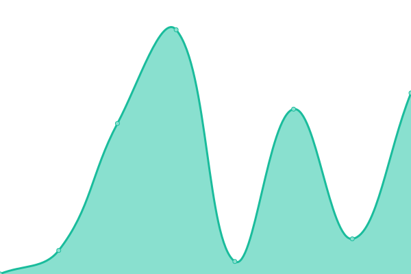
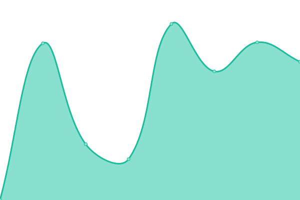

# [📈 Live Status](https://vinkashq.github.io/upptime): <!--live status--> **🟧 Partial outage**

This repository contains the open-source uptime monitor and status page for [Vinkas](https://vinkas.com), powered by [Upptime](https://github.com/upptime/upptime).

With [Upptime](https://upptime.js.org), you can get your own unlimited and free uptime monitor and status page, powered entirely by a GitHub repository. We use [Issues](https://github.com/vinkashq/upptime/issues) as incident reports, [Actions](https://github.com/vinkashq/upptime/actions) as uptime monitors, and [Pages](https://vinkashq.github.io/upptime) for the status page.

<!--start: status pages-->
<!-- This summary is generated by Upptime (https://github.com/upptime/upptime) -->
<!-- Do not edit this manually, your changes will be overwritten -->
<!-- prettier-ignore -->
| URL | Status | History | Response Time | Uptime |
| --- | ------ | ------- | ------------- | ------ |
|  [Vinkas](https://vinkas.com/api/health) | 🟩 Up | [vinkas.yml](https://github.com/vinkashq/upptime/commits/HEAD/history/vinkas.yml) | 

 300ms
     
 | 

<a href="https://status.vinkas.com/history/vinkas">100.00%</a>
    

|  [Vinkas Account](https://account.vinkas.com/health) | 🟩 Up | [vinkas-account.yml](https://github.com/vinkashq/upptime/commits/HEAD/history/vinkas-account.yml) | 

 1237ms
     
 | 

<a href="https://status.vinkas.com/history/vinkas-account">100.00%</a>
    

|  [Vinkas Community](https://community.vinkas.com/srv/status) | 🟥 Down | [vinkas-community.yml](https://github.com/vinkashq/upptime/commits/HEAD/history/vinkas-community.yml) | 

 0ms
     
 | 

<a href="https://status.vinkas.com/history/vinkas-community">0.00%</a>
    

|  [Vinkas Blog](https://blog.vinkas.com) | 🟩 Up | [vinkas-blog.yml](https://github.com/vinkashq/upptime/commits/HEAD/history/vinkas-blog.yml) | 

 167ms
     
 | 

<a href="https://status.vinkas.com/history/vinkas-blog">100.00%</a>
    

|  [Singfuse](https://singfuse.com) | 🟩 Up | [singfuse.yml](https://github.com/vinkashq/upptime/commits/HEAD/history/singfuse.yml) | 

 5059ms
     
 | 

<a href="https://status.vinkas.com/history/singfuse">100.00%</a>
    

|  [Singfuse Forum](https://forum.singfuse.com/srv/status) | 🟥 Down | [singfuse-forum.yml](https://github.com/vinkashq/upptime/commits/HEAD/history/singfuse-forum.yml) | 

 0ms
     
 | 

<a href="https://status.vinkas.com/history/singfuse-forum">0.00%</a>
    

|  [Singfact](https://singfact.com) | 🟩 Up | [singfact.yml](https://github.com/vinkashq/upptime/commits/HEAD/history/singfact.yml) | 

 203ms
     
 | 

<a href="https://status.vinkas.com/history/singfact">100.00%</a>
    

|  [Singfuse Legacy](https://legacy.singfuse.com/up) | 🟥 Down | [singfuse-legacy.yml](https://github.com/vinkashq/upptime/commits/HEAD/history/singfuse-legacy.yml) | 

 553ms
     
 | 

<a href="https://status.vinkas.com/history/singfuse-legacy">100.00%</a>
    

<!--end: status pages-->

[**Visit our status website →**](https://vinkashq.github.io/upptime)

## 📄 License

- Powered by: [Upptime](https://github.com/upptime/upptime)
- Code: [MIT](./LICENSE) © [Anand Chowdhary](https://anandchowdhary.com), supported by [Pabio](https://pabio.com)
- Data in the `./history` directory: [Open Database License](https://opendatacommons.org/licenses/odbl/1-0/)
